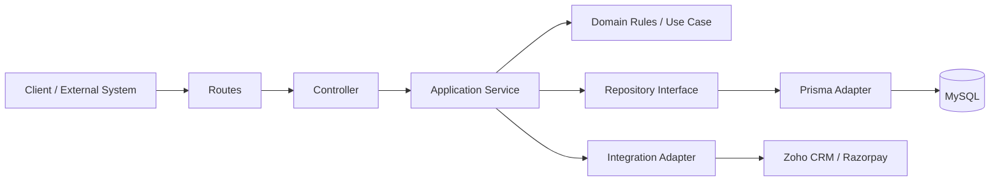
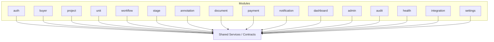
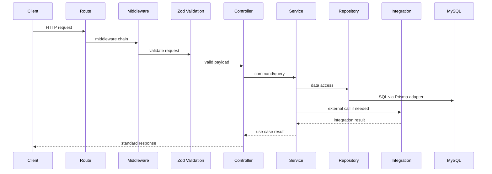
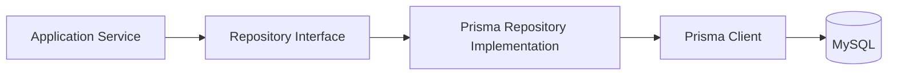
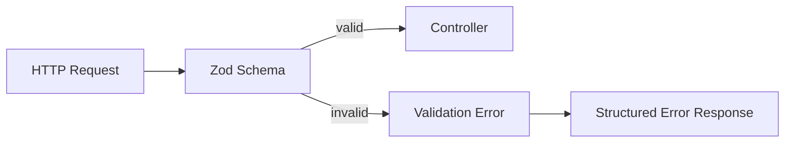
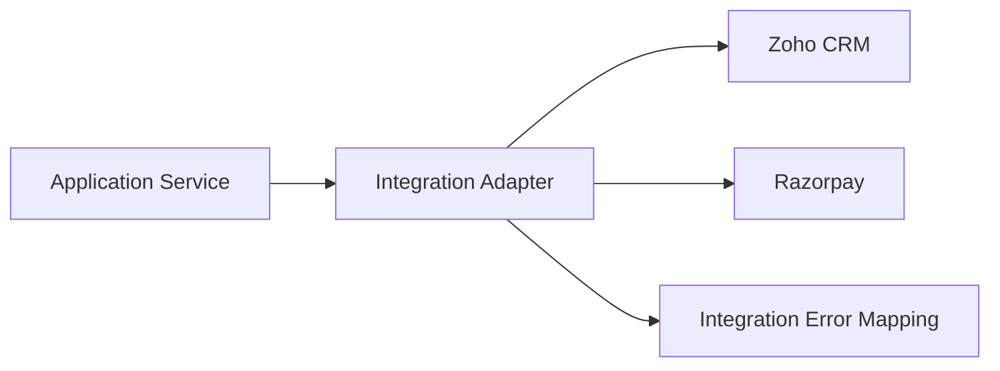
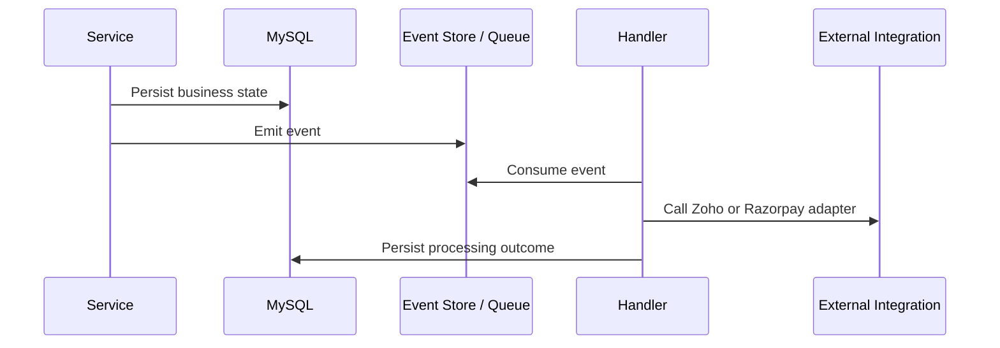

# Backend Architecture

## 1. Architecture Goals

The backend must support GoodEarth's post-sales operating model from booking to handover with a system that is maintainable, secure, observable, and easy to evolve.

Primary goals:

- Keep business rules isolated from transport, persistence, and integration concerns.
- Preserve clear boundaries between feature modules such as auth, buyer, project, unit, workflow, stage, annotation, document, payment, notification, dashboard, admin, audit, health, integration, and settings.
- Make external integrations explicit, retry-safe, and easy to test.
- Support production-grade observability through structured logs, predictable errors, and health endpoints.
- Enable safe evolution of the system through typed contracts, modular design, and testable services.
- Support AI-assisted development without weakening review rigor or architectural consistency.

Non-goals:

- No business behavior is defined beyond the approved post-sales scope.
- No UI concerns are modeled here.
- No implementation detail is prescribed beyond architecture-level conventions.

## 2. Architectural Style

The backend uses a **feature-first + Clean Architecture** approach.

### Feature-first

The codebase is organized around business capabilities rather than technical layers alone. Each feature owns its routes, controller logic, validation, application services, domain rules, and persistence adapters.

### Clean Architecture

Dependencies point inward:

- Outer layers handle HTTP, logging, validation, and database adapters.
- Inner layers contain application use cases and domain rules.
- Integrations and persistence are interfaces or adapters, not the source of business logic.

This prevents Express, Prisma, Zod, Zoho CRM, Razorpay, and MySQL concerns from leaking into core application logic.



## 3. Folder Structure

The backend folder structure should remain aligned with the scaffold already created under `apps/backend`.

```text
apps/backend/
  package.json
  tsconfig.json
  tsconfig.build.json
  .env.example
  README.md
  prisma/
    schema.prisma
    migrations/
    seed.ts
  src/
    app.ts
    server.ts
    index.ts
    config/
    constants/
    controllers/
    middlewares/
    routes/
    services/
    repositories/
    validators/
    utils/
    types/
    modules/
      auth/
      buyer/
      project/
      unit/
      workflow/
      stage/
      annotation/
      document/
      payment/
      notification/
      dashboard/
      admin/
      audit/
      health/
      integration/
      settings/
    integrations/
      zoho-crm/
      razorpay/
    jobs/
    events/
  tests/
```

### Structural intent

- `src/modules/*` owns feature-specific implementation.
- Each feature module owns its controller, service, repository, routes, validation, and DTOs.
- `src/integrations/*` owns third-party system adapters.
- `prisma/` owns Prisma schema, migrations, and seeding. Prisma stays outside `src/`.
- `src/controllers`, `src/routes`, `src/middlewares`, and `src/validators` provide the transport layer.
- `src/services` contains application services that coordinate repositories, integrations, and business rules.
- `src/repositories` exposes data access abstractions.
- `src/events` and `src/jobs` support asynchronous and deferred work.

## 4. Module Boundaries

Feature modules must not reach across each other by importing internal implementation details.

### Expected ownership

| Module | Responsibility |
| --- | --- |
| `auth` | Authentication and authorization orchestration. |
| `buyer` | Buyer identity and buyer-originated context. |
| `project` | Project-level operational context and ownership. |
| `unit` | Unit-level context and lifecycle state. |
| `workflow` | Workflow orchestration and state progression. |
| `stage` | Stage definitions and stage state management. |
| `annotation` | Internal annotations and operational notes. |
| `document` | Document metadata and document lifecycle tracking. |
| `payment` | Payment-related context and reconciliation support. |
| `notification` | Notification dispatch and notification state tracking. |
| `dashboard` | Aggregated operational views and read models. |
| `admin` | Administrative controls and platform management. |
| `audit` | Audit trail capture and activity history. |
| `health` | Liveness and readiness reporting. |
| `integration` | Integration orchestration and external system coordination. |
| `settings` | Platform and workflow configuration. |

### Boundary rules

- Feature modules may depend on shared abstractions, not each other's internals.
- Cross-feature coordination belongs in an application service or event handler, not in a controller.
- Shared types should live in `packages/shared-types` only when the contract is genuinely reused across apps.
- Common utilities should remain generic and side-effect free.

### Data Ownership

The backend must treat ownership explicitly to avoid conflicting sources of truth.

| Domain | System of Record |
| --- | --- |
| Buyer | GoodEarth Post-Sales Platform |
| Project | GoodEarth Post-Sales Platform |
| Unit | GoodEarth Post-Sales Platform |
| Workflow | GoodEarth Post-Sales Platform |
| Documents | GoodEarth Post-Sales Platform |
| Payments | Razorpay for payment transaction truth; GoodEarth Post-Sales Platform for operational payment state |
| Audit | GoodEarth Post-Sales Platform |

External systems remain authoritative for the data they own. The backend may mirror or cache selected fields, but mirrored data is not the system of record unless explicitly stated above.



## 5. Request Lifecycle

The request lifecycle should be predictable and narrow.

1. Request enters the Express router.
2. Middleware performs request-level concerns such as correlation, authentication, and basic normalization.
3. Route-level validation checks the payload using Zod.
4. Controller adapts HTTP request data into a command or query object.
5. Application service executes business use case orchestration.
6. Repository or integration adapters are invoked as needed.
7. Response is mapped into a standard API envelope.
8. Errors are translated into structured HTTP responses.



## 6. Authentication Architecture

Authentication should be centralized and decoupled from feature logic.

### Principles

- Authentication is an infrastructure concern, not a domain concern.
- The backend should verify identity before executing protected operations.
- Credentials, tokens, and session material must not leak into logs.
- The implementation should support future expansion without redesigning feature modules.

### Expected shape

- An auth middleware resolves the current principal from the incoming request.
- The principal is attached to request context as a typed object.
- Downstream services consume identity context, not raw headers or tokens.
- Unauthenticated requests are rejected early with a consistent error response.

### Current architectural assumptions

- Support bearer-token style authentication unless a different enterprise identity mechanism is later approved.
- Keep credential verification behind an auth service or guard layer.
- Keep identity claims narrow: subject, role set, and any approved tenant or scope markers.

## 7. Authorization Strategy

Authorization should be role-based with explicit checks at the service boundary.

### Strategy

- Use role-based access control for internal and operational users.
- Evaluate permissions in middleware or service guards before sensitive operations.
- Keep authorization rules close to the use case they protect.
- Use explicit deny-by-default behavior.

### Rules

- Controllers must not implement authorization logic directly.
- Route guards may perform coarse access checks.
- Services must perform final authorization checks for sensitive workflow transitions.
- Admin operations must be isolated and reviewed carefully.

### Design note

Roles are business-defined, not technical defaults. Authorization policies should be documented separately if they become more detailed than this architecture note.

## 8. Database Layer

The backend uses MySQL as the system of record for application-owned data.

### Database responsibilities

- Persist operational data required by the platform.
- Support transactional consistency where workflow updates require atomicity.
- Store audit records and application state.
- Avoid direct coupling between business code and raw SQL in the application layer.
- Keep Prisma schema, migrations, and seed data outside `src/` under `apps/backend/prisma/`.

### Design principles

- Treat the database as an infrastructure dependency.
- Keep schema ownership in `apps/backend/prisma`.
- Use transactions for multi-step workflow changes that must remain consistent.
- Model indexes around access patterns, not just normalized structure.
- Prefer explicit foreign keys and constrained relationships where they improve correctness.

### Data ownership

The backend owns the application data it persists. External system truth remains in Zoho CRM or Razorpay where applicable.

## 9. Prisma Integration Strategy

Prisma should be used as the database access adapter, not as the place where business logic lives.

### Strategy

- Prisma Client is configured once and shared through a database adapter.
- Prisma calls are hidden behind repository implementations.
- Application services depend on repository interfaces, not Prisma directly.
- Prisma schema and migrations remain part of the database layer, not feature code.

### Why this matters

- Keeps query details out of use cases.
- Makes tests easier to isolate through repository fakes.
- Prevents Prisma types from becoming the domain model.
- Reduces blast radius when schema changes are required.

### Recommended pattern



## 10. Repository Pattern

Repositories provide a stable contract for persistence operations.

### Responsibilities

- Load and store data for a specific aggregate or read model.
- Encapsulate query construction and Prisma usage.
- Convert persistence records to and from application-friendly shapes.
- Keep database details out of services and controllers.

### Constraints

- Repositories should not contain business orchestration.
- Repositories should not know about HTTP.
- Repositories should not call other repositories for workflow orchestration.
- Repositories should expose intent-based methods, not generic data access shortcuts.

### Example style

- `findById`
- `findByBookingReference`
- `save`
- `updateStatus`
- `appendAuditEvent`

The exact method names must follow the bounded context they serve.

## 11. Service Layer

Services are the application layer of the backend.

### Responsibilities

- Orchestrate use cases.
- Enforce business workflow sequencing.
- Coordinate repositories and integrations.
- Manage transaction boundaries where needed.
- Raise domain or application errors when business rules are violated.

### Service rules

- Services should be deterministic and testable.
- Services should not expose transport concerns.
- Services should not contain SQL or Prisma-specific code.
- Services should not parse raw HTTP requests.

### Classification

- Query services retrieve data for read use cases.
- Command services mutate state and coordinate workflows.
- Integration services encapsulate interaction with Zoho CRM and Razorpay.

## 12. Controller Responsibilities

Controllers should remain thin.

### Controllers do

- Accept HTTP requests.
- Extract request parameters, body, headers, and identity context.
- Call the correct application service.
- Translate the service result into an HTTP response.
- Forward errors to centralized error handling.

### Controllers do not

- Implement business rules.
- Access Prisma directly.
- Manage authorization policy.
- Call external integrations directly.
- Contain complex mapping logic that belongs in services or mappers.

Controllers are a transport adapter, not the center of the system.

## 13. Validation Strategy

Use **Zod** at the boundaries of the system.

### Where validation happens

- Request body validation.
- Query parameter validation.
- Path parameter validation.
- Webhook payload validation.
- Environment variable validation.
- Internal command validation where the service boundary benefits from explicit contracts.

### Validation principles

- Validate early and fail fast.
- Keep schemas co-located with the feature or route they protect.
- Derive TypeScript types from Zod schemas where practical.
- Normalize and sanitize inputs before service execution.
- Treat external payloads as untrusted even when they come from known integrations.

### Validation flow



## 14. Error Handling

Errors should be consistent, typed, and safe for production.

### Error categories

- Validation errors
- Authentication errors
- Authorization errors
- Not found errors
- Conflict errors
- Integration errors
- Database errors
- Unexpected server errors

### Handling rules

- Centralize error translation in middleware.
- Convert internal exceptions into stable API responses.
- Do not expose stack traces or sensitive internal details to clients.
- Preserve enough diagnostic detail in server logs for debugging.
- Prefer typed application errors over ad hoc throw statements.

### Error response model

Responses should include a stable error code, human-readable message, and optional request correlation identifier.

## 15. Logging Strategy

Use **Pino** for structured logging.

### Logging goals

- Support debugging in production.
- Preserve request correlation.
- Emit machine-readable logs.
- Avoid sensitive-data leakage.

### Logging principles

- Log in structured JSON.
- Include request ID, actor context, route, status, and latency where relevant.
- Use log levels consistently.
- Keep error logs rich enough for support, but never include secrets or raw sensitive payloads.
- Redact credentials, tokens, payment secrets, and personal data where not needed.

### Suggested log levels

- `fatal` for unrecoverable process failures
- `error` for failed operations
- `warn` for recoverable anomalies
- `info` for lifecycle and key business milestones
- `debug` for developer diagnostics in non-production environments

## 16. API Response Standards

API responses should be predictable across the backend.

### Success responses

- Use a stable JSON envelope.
- Include a `data` property for the payload.
- Include metadata only when necessary.

### Error responses

- Use a stable error envelope.
- Include a machine-readable `code`.
- Include a human-readable `message`.
- Include `requestId` when available.

### Response principles

- Keep formats consistent across modules.
- Avoid leaking implementation details.
- Keep pagination and filtering shapes standardized.
- Version the API when breaking changes cannot be avoided.

## 17. External Integrations

External integrations must be isolated behind dedicated adapters.

### Zoho CRM

- Keep Zoho API calls in the integration layer.
- Support inbound webhooks for changes that Zoho emits to the platform.
- Support outbound API calls for platform-originated synchronization.
- Treat Zoho as an external source of truth for CRM-managed data.
- Normalize API errors into application-specific integration errors.
- Persist integration state so retries can resume safely after partial failure.
- Process inbound and outbound events idempotently using stable external identifiers and deduplication keys.
- Use retry policies for transient failures only, with bounded attempts and dead-letter or failure tracking where appropriate.
- Separate webhook ingestion from business processing so payload verification, persistence, and processing can evolve independently.
- Design synchronization so duplicate webhook delivery, network retries, and out-of-order retries do not create conflicting state.

### Razorpay

- Keep Razorpay payment calls and webhook handling in the integration layer.
- Verify webhook signatures before processing events.
- Treat webhook delivery as at-least-once.
- Ensure the handler is idempotent and safe to replay.

### Integration boundary flow



### Integration rules

- Never embed third-party SDK behavior throughout the codebase.
- Never let integration responses dictate business logic without validation.
- Normalize external failures into controlled application errors.
- Use retries only where idempotency is guaranteed.

## 18. Event Flow

The backend should support event-driven handling for state changes and integration side effects where appropriate.

### Event categories

- Domain events for internal state changes.
- Integration events for outgoing synchronization.
- Webhook events for inbound Razorpay delivery.
- Audit events for traceable system activity.

### Event handling principles

- Event handlers must be idempotent.
- Event emission should happen after successful state transitions.
- Event processing should be decoupled from request latency where possible.
- Failed events should be logged and retriable through a controlled mechanism.



### Important constraint

Event flow should support the business process, not become a second hidden application layer. The request path remains authoritative for synchronous state transitions.

## 19. Testing Strategy

Testing must follow the architecture.

### Test pyramid

- Unit tests for services, validators, mappers, and pure utilities.
- Integration tests for repositories, Prisma adapters, and database queries.
- Contract or adapter tests for Zoho CRM and Razorpay integration boundaries.
- End-to-end tests for critical request flows.

### What to test

- Request validation behavior.
- Authorization decisions.
- Service orchestration and business rules.
- Repository contracts and persistence behavior.
- Webhook idempotency and signature validation.
- Error mapping and API response shape.
- Logging and correlation behavior where practical.

### Testing rules

- Test behavior, not implementation detail.
- Mock boundaries, not internal logic.
- Use realistic fixtures for integration contracts.
- Keep tests deterministic and isolated.

## 20. Future Scalability

The architecture should scale without forcing a rewrite.

### Scalability directions

- Add modules without coupling them tightly to the rest of the backend.
- Introduce queues or background workers for slow or retry-heavy integration tasks.
- Support horizontal scaling by keeping request handling stateless.
- Keep database transactions short and targeted.
- Move reporting-heavy reads to dedicated read models if needed later.
- Introduce caching only when it is justified by measured need.

### Long-term design safeguards

- Preserve typed contracts between layers.
- Keep integration adapters swappable.
- Maintain a narrow service API per module.
- Prefer explicit dependencies over global singletons.
- Keep architecture decisions documented as the system grows.

### Final note

This architecture is intentionally conservative. It prioritizes correctness, traceability, and maintainability for an enterprise post-sales platform whose value depends on dependable workflow execution and integration fidelity.
