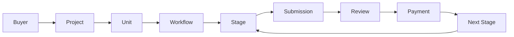
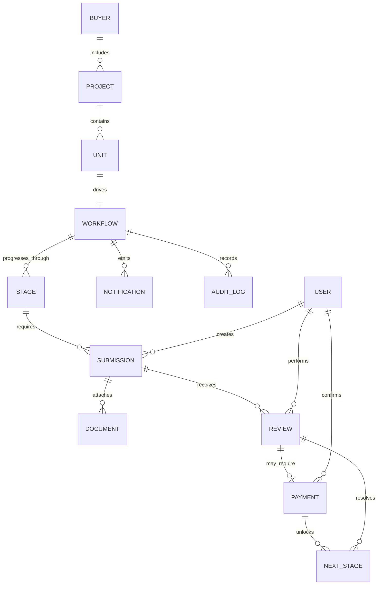

# Business Domain Model

## Scope

This document models the GoodEarth Post-Sales Platform as a business domain, not as a database design or implementation blueprint.

It defines:

- the business entities used in the post-sales workflow,
- the responsibility of each entity,
- the system of record for each entity, and
- the business relationships that connect the workflow from buyer intake through next-stage progression.

This is a conceptual domain model only. It does not define tables, ORM mappings, Prisma schema, API contracts, or UI behavior.

## Domain Principles

- The model follows the business flow used by the post-sales client portal.
- Zoho CRM remains the system of record for source customer and sales master data where applicable.
- The Portal remains the system of record for operational workflow, submission, review, payment tracking, supporting documents, notifications, audit logs, and user activity.
- Relationships in this document describe business meaning, not physical storage.
- The model is intentionally future-ready for additional workflow states and operational controls.

## Business Entities

| Entity | Responsibility | Ownership |
| --- | --- | --- |
| Buyer | Represents the customer or buyer account entering the post-sales journey. | Zoho CRM |
| Project | Represents the project context associated with the buyer. | Zoho CRM |
| Unit | Represents the specific unit or allocation that the buyer is progressing against. | Zoho CRM |
| Workflow | Represents the active post-sales journey instance for a buyer, project, and unit. | Portal |
| Stage | Represents a named step within the workflow lifecycle. | Portal |
| Submission | Represents the formal packet of information or documents submitted for evaluation. | Portal |
| Review | Represents the business review outcome of a submission. | Portal |
| Payment | Represents payment status, payment events, and operational payment confirmation. | Portal |
| Next Stage | Represents the next permitted stage after review and payment conditions are satisfied. | Portal |
| Document | Represents supporting files or document references attached to the workflow. | Portal |
| Notification | Represents outbound communication, reminders, and status alerts. | Portal |
| Audit Log | Represents the immutable record of domain-relevant activity and state change. | Portal |
| User | Represents a portal identity used by buyers, operations users, or administrators. | Portal |

## Entity Responsibilities

### Buyer

Holds the buyer identity at the business level and anchors the rest of the post-sales journey. The buyer is the top-level commercial context for the workflow.

### Project

Captures the project context associated with the buyer and provides the business grouping under which units and workflow activity are tracked.

### Unit

Represents the specific unit linked to the buyer and project. The unit is the operational object that moves through the post-sales process.

### Workflow

Represents the active business process for a buyer, project, and unit combination. It coordinates stage progression and tracks where the unit is in the portal journey.

### Stage

Represents a discrete step in the workflow. A stage defines what the portal expects, what is under review, and what must happen before progression.

### Submission

Represents the formal handoff of information, documents, or operational material required for a stage to move forward.

### Review

Represents the evaluation of a submission against the business requirements for the current stage.

### Payment

Represents the payment-related business state relevant to the workflow. It tracks whether the required payment condition has been met for progression.

### Next Stage

Represents the resolved destination stage after review and payment rules are satisfied. It is a domain outcome used to continue the workflow.

### Document

Represents supporting documents attached to a submission, review, or workflow step.

### Notification

Represents communication sent to inform users about required actions, progress, or state changes.

### Audit Log

Represents the immutable record of important business actions, status transitions, and operational events.

### User

Represents the identity that interacts with the portal. Users can be buyers, internal operational users, or administrators depending on the access model.

## Workflow Model

The business workflow is modeled as:

`Buyer -> Project -> Unit -> Workflow -> Stage -> Submission -> Review -> Payment -> Next Stage`

This flow expresses the primary progression of the post-sales journey. It is not a fixed one-time sequence; a workflow may contain repeated stage cycles, review loops, and payment confirmations before moving to the next stage.

## Core Entity Relationships

## Supporting Entities

### Document

Documents support the workflow without becoming the workflow itself. Documents may be associated with a submission, review, or broader workflow context depending on the stage requirements.

### Notification

Notifications are future-ready operational outputs. They support reminders, approvals, escalation notices, and status updates without changing the underlying business state.

### Audit Log

Audit logs preserve traceability for important workflow actions, user actions, and system-driven changes. They are part of the business domain because accountability is an operational requirement.

### User

Users represent the human or operational actor interacting with the portal. The model keeps users separate from buyer records so identity, permissions, and workflow activity remain distinct.

## Ownership Summary

### Zoho CRM owned entities

- Buyer
- Project
- Unit

Zoho CRM is the authoritative source for master sales context. The portal may consume and display this data, but it should not redefine ownership for these entities.

### Portal owned entities

- Workflow
- Stage
- Submission
- Review
- Payment
- Next Stage
- Document
- Notification
- Audit Log
- User

The Portal owns the operational journey and all workflow artifacts created during post-sales execution.

## Domain Boundaries

- Buyer, Project, and Unit establish the commercial context.
- Workflow and Stage define progress through the post-sales process.
- Submission and Review define the gatekeeping cycle that determines whether progression can continue.
- Payment is a workflow condition, not a separate commercial product model in this document.
- Next Stage is a derived business outcome, not a manually invented shortcut.
- Document, Notification, Audit Log, and User support the workflow and must remain aligned to it.

## Domain Notes

- The model intentionally stops at business meaning and does not prescribe persistence design.
- The portal may mirror Zoho CRM data, but mirrored data is still subordinate to the defined system of record.
- The workflow may contain multiple stage loops as the business process requires, but the canonical progression remains the same.
- Future expansion should add entities only when they represent a distinct business responsibility.
